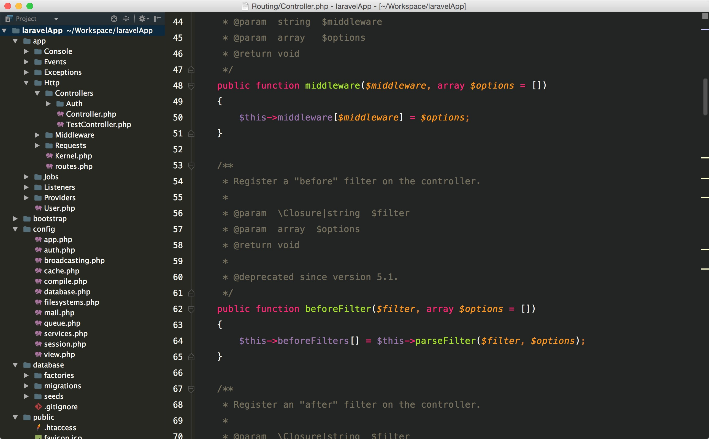

# phpstorm-theme
set your PhpStrom-IDE in a simple way

## Setting method

open phpstorm and select <code>File</code> -> <code>Import Settings</code>, then add the theme file,;finally,restart your IDE.

### the theme on mac

If you like dark theme, It fits you well.

I think it's so cool.

